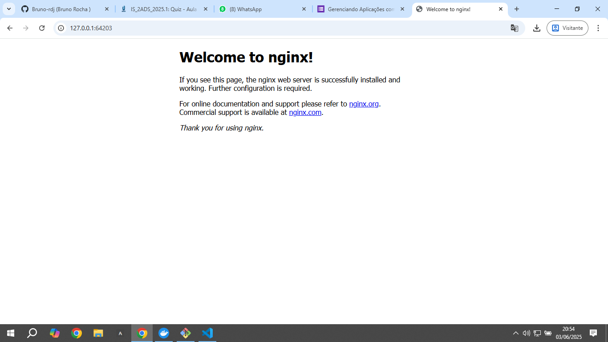
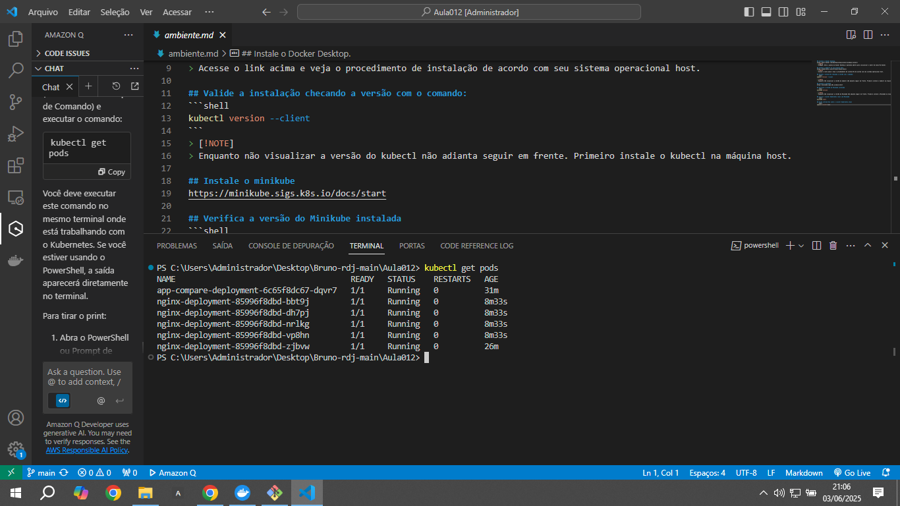

# Gerenciando Aplicações com Kubernetes

Este repositório contém os arquivos e instruções para o exercício de gerenciamento de aplicações Nginx usando Kubernetes e Minikube.

## Pré-requisitos

- [Docker Desktop](https://docs.docker.com/desktop/setup/install/windows-install/)
- [kubectl](https://kubernetes.io/pt-br/docs/tasks/tools/)
- [Minikube](https://minikube.sigs.k8s.io/docs/start)
- Git

## Estrutura do Projeto

```
TF.Kubectl/
├── compare-names-app/       # Aplicação de comparação de nomes
│   ├── src/
│   │   └── app.py          # Código fonte da aplicação Streamlit
│   └── requirements.txt    # Dependências da aplicação
├── imagens/                # Capturas de tela das aplicações
│   └── .gitkeep            # Arquivo para manter a pasta no Git mesmo vazia
├── k8s/                    # Arquivos Kubernetes para a aplicação Compare Names
│   ├── deployment.yaml
│   └── service.yaml
├── docker-compose.yml      # Configuração para execução local com Docker Compose
├── Dockerfile              # Instruções para construir a imagem Docker
├── nginx-deployment.yaml   # Deployment do Nginx com 2 réplicas
├── nginx-service.yaml      # Serviço NodePort para o Nginx
├── README-COMPARE-APP.md   # Instruções para a aplicação Compare Names
└── README-NGINX.md         # Instruções detalhadas para o exemplo do Nginx
```

## Instruções de Uso

### 1. Verificar o Status do Cluster

```bash
kubectl cluster-info
```

### 2. Implantar a Aplicação

```bash
# Aplicar o arquivo de deployment
kubectl apply -f nginx-deployment.yaml

# Verificar o status da implantação
kubectl get deployments

# Verificar o status dos pods
kubectl get pods

# Aplicar o arquivo de serviço
kubectl apply -f nginx-service.yaml

# Verificar o status do serviço
kubectl get services
```

### 3. Acessar a Aplicação

```bash
# Obter a URL para acessar a aplicação
minikube service nginx-service --url
```

Acesse a URL no navegador para visualizar a página do Nginx.

### 4. Escalar a Aplicação

```bash
# Editar o arquivo nginx-deployment.yaml e alterar replicas: 2 para replicas: 5
# Aplicar as mudanças
kubectl apply -f nginx-deployment.yaml

# Verificar o status dos pods
kubectl get pods
```

### 5. Reduzir a Aplicação

```bash
# Editar o arquivo nginx-deployment.yaml e alterar replicas: 5 para replicas: 1
# Aplicar as mudanças
kubectl apply -f nginx-deployment.yaml

# Verificar o status dos pods
kubectl get pods
```

### 6. Explorar os Logs

```bash
# Visualizar os logs de um pod
kubectl logs <nome-do-pod>
```

### 7. Limpar o Ambiente

```bash
# Deletar o serviço e a implantação
kubectl delete -f nginx-service.yaml
kubectl delete -f nginx-deployment.yaml

# Verificar se os pods e serviços foram removidos
kubectl get deployments
kubectl get services
```

## Imagens

### Página do Nginx


### Pods em Execução (5 réplicas)

## Aplicações Adicionais

Este repositório também contém uma aplicação adicional "Compare Names App" desenvolvida com Streamlit. Para instruções sobre como executar esta aplicação, consulte o arquivo [README-COMPARE-APP.md](README-COMPARE-APP.md).